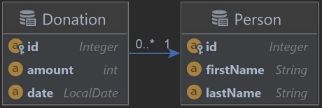

# Labor_5_1-Donations

Programmieren 5.Klasse  
Labor übung 1

Angabe:      
[Copyright HTL St.Pölten Informatik](https://www.htlstp.ac.at/abteilungen/informatik)  
 REST Donations![]

Erzeuge eine Struktur gemäß folgendem ER-Diagram:

Das beiliegende Files data.sql erzeugt Testdaten für eine Datenbank. Regeln:

- Die ids sind autogeneriert
- firstName und lastName dürfen nicht leer sein
- Das date einer Donation darf nicht in der Zukunft liegen und es müssen mindestens 5 Geldeinheiten gespendet werden
- Allfällige Fehler sind über einen zentralen Exceptionhandler zu behandeln Implementiere einen RESTful Webservice mit
  folgenden Endpoints:

- GET /api/donations?min=  
  returnt alle Personen, welche in Summe mindestens min gespendet haben
- GET /api/donations/ {id }
  returnt die Donation bzw 404
- GET /api/persons/ {id }/donations  
  returnt alle Donation der Person bzw 404, wenn die Person nicht existiert
- POST /api/persons/ {id }/donations  
  speichert eine neue Donation der Person
